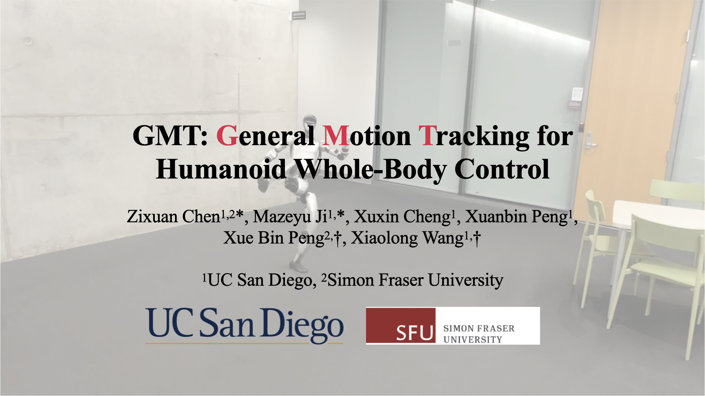

<h1 align="center">General Motion Tracking for <br> Humanoid Whole-Body Control</h1>


<p align="center">
    <a href="https://zixuan417.github.io/"><strong>Zixuan Chen<sup>*,1,2</sup></strong></a>
    |
    <a href="https://jimazeyu.github.io/"><strong>Mazeyu Ji<sup>*,1</sup></strong></a>
    |
    <a href="https://chengxuxin.github.io/"><strong>Xuxin Cheng<sup>1</sup></strong></a>
    |
    <a href="https://xuanbinpeng.github.io/"><strong>Xuanbin Peng<sup>1</sup></strong></a>
    <br>
    <a href="https://xbpeng.github.io/"><strong>Xue Bin Peng†<sup>2</sup></strong></a>
    |
    <a href="https://xiaolonw.github.io/"><strong>Xiaolong Wang†<sup>1</sup></strong></a>
    <br>
    <sup>1</sup> UC San Diego
    &nbsp
    <sup>2</sup> Simon Fraser University
    <br>
    * Equal Contribution
    &nbsp
    † Equal Advising
</p>

<p align="center">
<h3 align="center"><a href="https://gmt-humanoid.github.io">Website</a> | <a href="https://arxiv.org">arXiv</a> | <a href="https://youtu.be/n6p0DzpYjDE?si=6oIIx_Er36Ch7XWY">Video</a> </h3>
<div align="center"></div>
</p>

<p align="center">

</p>

## Overview
This codebase supports Mujoco simulation of motion tracking on Unitree G1 robot. We provide a pretrained checkpoint and several example motions. This codebase is lightweight and easy to use. We have tested it both on Linux and M1 MacOS.

## Installation && Running

First, clone this repo and install all the dependencies:
```bash
conda create -n gmt python=3.8 && conda activate gmt
pip3 install torch torchvision torchaudio
pip install "numpy==1.23.0" pydelatin tqdm opencv-python ipdb imageio[ffmpeg] mujoco mujoco-python-viewer scipy matplotlib
```
Then you can start to test the pretrained policy's performance on several example motions by running the following command:
```bash
python sim2sim.py --robot g1 --motion walk_stand.pkl
```
To change motions, you can replace `walk_stand.pkl` with other motions in the [motions](assets/motions/) folder.

You can also view the kinematics motion by running:
```bash
python view_motion.py --motion walk_stand.pkl
```

## ‼️Alert & Disclaimer
Although the pretrained policy has been successfully tested on our machine, the performance of the policy might vary on different robots. We cannot guarantee the success of deployment on every machine. The model we provide is for research use only, and we disclaim all responsibility for any harm, loss, or malfunction arising from its deployment.

## Acknowledgements
+ The Mujoco simulation script is originally adapted from [LCP](https://github.com/zixuan417/smooth-humanoid-locomotion).
+ For human motion part, we mainly refer to [ASE](https://github.com/nv-tlabs/ASE) and [PHC](https://github.com/ZhengyiLuo/PHC).

## Citation
If you find this codebase useful, please consider citing our work:
```bibtex
@article{chen2025gmt,
title={GMT: General Motion Tracking for Humanoid Whole-Body Control},
author={Chen, Zixuan and Ji, Mazeyu and Cheng, Xuxin and Peng, Xuanbin and Peng, Xue Bin and Wang, Xiaolong},
journal={arXiv:2506.xxxx},
year={2025}
}
```
